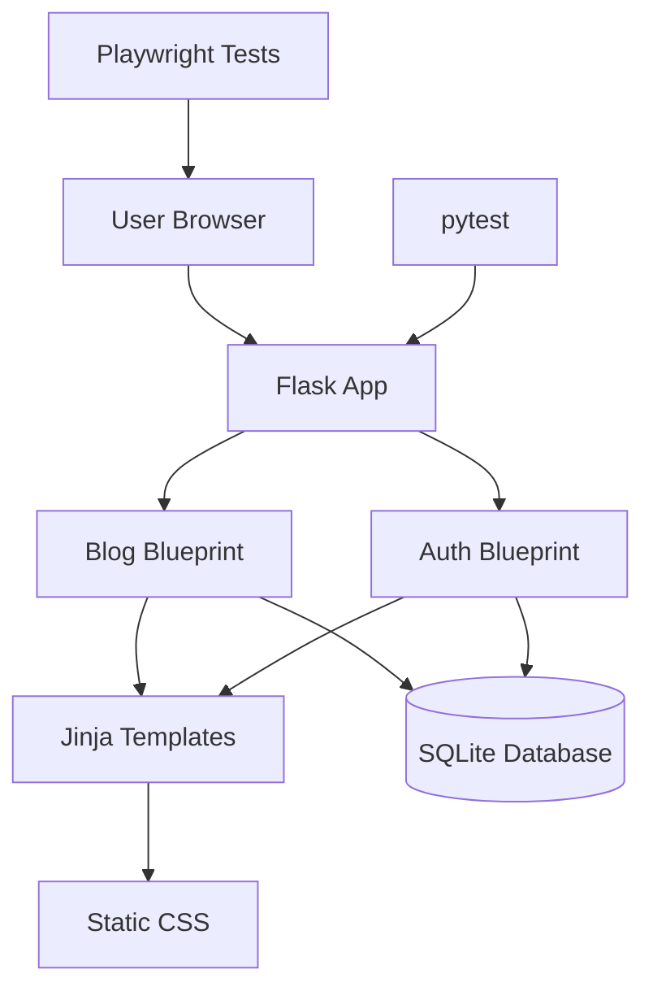

# Final SDLC Documentation - Flaskr Blog Enhancement

## Document Control

- Repository: https://github.com/kamal080793/ai-assistant-driven-sdlc-flaskr
- Default branch: main
- Documentation status: Final documentation package prepared
- Human review status: Approved as-is for the backlog content
- Confluence status: Publishing blocked by 403 access error; this file is Confluence-ready manual publishing source

## 1. Functional Requirements Document (FRD)

### Objective
Enhance the Flaskr blog application so readers can discover posts more effectively and authors can manage post metadata, while improving delivery readiness with automated browser tests, local scripts, and documentation.

### Current Capabilities
- User registration with password hashing.
- User login and logout with session-based authentication.
- Public blog post listing.
- Authenticated post creation.
- Author-only post update and delete.
- Flash-message feedback.
- SQLite database initialization.
- pytest test coverage for core Flaskr behavior.

### Approved Epic
**Enhance Flaskr Blog Management and Delivery Readiness**

Improve the Flaskr blog application with post discovery, post metadata, lifecycle management, automated browser testing, local deployment scripts, and updated documentation.

### Approved User Stories
1. **Search blog posts**  
   As a blog reader, I want to search blog posts by keyword so that I can quickly find relevant content.

2. **Manage post category, status, and due date**  
   As a blog author, I want to assign category, status, and an optional due date to posts so that I can organize and manage blog content.

3. **Filter posts by category and status**  
   As a blog reader, I want to filter posts by category and status so that I can narrow the post list to relevant content.

4. **Improve delivery readiness with automation and documentation**  
   As a developer, I want automated Playwright tests, local build and deployment scripts, and updated documentation so that I can verify and run the application consistently.

## 2. Architecture Document

### Existing Architecture
Flaskr is a server-rendered Flask application using:
- Flask application factory.
- Blueprints for authentication and blog routes.
- SQLite for persistence.
- Jinja2 templates for HTML rendering.
- Static CSS for styling.
- pytest for backend tests.

### Proposed Enhancement Architecture
- Extend blog index route query handling for search, category filter, and status filter.
- Extend post schema with category, status, and nullable due_date fields.
- Validate status and due-date values server-side in create/update handlers.
- Extend templates with search/filter controls and metadata form fields.
- Add Playwright browser tests alongside existing pytest coverage.
- Add local build/deployment helper scripts when implementation starts.

## 3. Architecture Diagram



## 4. High-Level Design (HLD)

### Search and Filtering
- The blog index route accepts query parameters such as `q`, `category`, and `status`.
- Search matches post title and body.
- Filters can be applied independently or together.
- Empty search returns the default post list.
- No matching results show a user-friendly no-results message.

### Metadata Management
- Create and update forms include category, status, and optional due date.
- Status values are restricted to draft, published, and archived.
- Due date is optional but must be valid when supplied.
- Existing values are pre-populated on edit.

### Test and Delivery Readiness
- pytest validates route and persistence behavior.
- Playwright validates browser workflows.
- README and documentation explain install, run, test, local deployment, and demo flow.

## 5. Low-Level Design (LLD)

### Data Model Changes
Proposed `post` table additions:
- `category TEXT`
- `status TEXT NOT NULL DEFAULT 'draft'`
- `due_date TEXT NULL`

### Route-Level Changes
- `GET /`: reads query parameters and builds filtered SQL query.
- `GET/POST /create`: handles new metadata fields.
- `GET/POST /<id>/update`: loads and updates metadata fields.

### Validation Rules
- Title is required.
- Status must be one of draft, published, archived.
- Due date can be blank.
- Due date must be a valid date when provided.

## 6. Wireframes

### Blog Index
```text
+------------------------------------------------+
| Flaskr                  user / login / logout  |
+------------------------------------------------+
| Posts                              [New]       |
| Search: [ keyword             ] [Search]       |
| Category: [All v] Status: [All v] [Apply]      |
|                                                |
| +--------------------------------------------+ |
| | Post Title                                  | |
| | by author on date                           | |
| | Category: X | Status: published | Due: date | |
| | Post body preview/content                   | |
| | [Edit] author only                          | |
| +--------------------------------------------+ |
+------------------------------------------------+
```

### Create/Edit Post
```text
Title:    [________________]
Body:     [________________]
Category: [________________]
Status:   [draft|published|archived]
Due date: [YYYY-MM-DD]
[Save]
```

## 7. Implementation Plan

1. Create Jira Epic and approved child stories.
2. Create implementation branch and link to Jira.
3. Update schema and database initialization.
4. Implement metadata create/update flows.
5. Implement search and filter behavior.
6. Update templates and CSS.
7. Add pytest coverage.
8. Add Playwright test configuration and browser tests.
9. Add local build/deployment scripts.
10. Update README and Confluence documentation.
11. Run pytest and Playwright.
12. Perform local deployment smoke test.
13. Complete human documentation review and final sign-off.

## 8. Test Case Summary

| Test Area | Planned Coverage |
|---|---|
| Search | matching title/body, partial keyword, empty query, no results |
| Metadata | create with category/status/due date, optional due date, invalid due date |
| Filters | category only, status only, combined category/status, no results |
| Auth | logged-out public read/search, logged-in author create/edit |
| Browser | Playwright workflows for search, filter, create metadata, edit metadata |
| Regression | existing auth, blog CRUD, database tests remain passing |

## 9. Test Execution Report

Current state:
- Existing repository has pytest tests for factory, db, auth, and blog behavior.
- New enhancement tests are pending implementation.
- Final execution evidence must be attached after implementation.

Expected commands:
```bash
pip install -e '.[test]'
pytest
coverage run -m pytest
coverage report
```

Playwright command to be finalized during implementation.

## 10. Deployment Notes

Local deployment process:
```bash
git clone https://github.com/kamal080793/ai-assistant-driven-sdlc-flaskr.git
cd ai-assistant-driven-sdlc-flaskr
python3 -m venv .venv
. .venv/bin/activate
pip install -e .
flask --app flaskr init-db
flask --app flaskr run --debug
```

Open http://127.0.0.1:5000 and smoke-test registration, login, post creation, post update, delete, and logout.

## 11. Demo Flow Evidence

Demo flow to capture after implementation:
1. Show Jira Epic and child stories.
2. Show Confluence documentation package.
3. Show Git branch, commits, and PR.
4. Run pytest and show passing result.
5. Run Playwright and show passing browser workflows.
6. Start the app locally.
7. Demonstrate registration/login.
8. Demonstrate creating a post with metadata.
9. Demonstrate searching posts.
10. Demonstrate filtering by category/status.
11. Demonstrate editing metadata.
12. Show README and deployment notes.

## 12. Traceability Matrix

| Artifact | Link / Status |
|---|---|
| Repository | https://github.com/kamal080793/ai-assistant-driven-sdlc-flaskr |
| Initial commit | https://github.com/kamal080793/ai-assistant-driven-sdlc-flaskr/commit/64b0d7b13a63e8d7b821c35b485eac05b7a9c46c |
| Jira Epic | Pending creation |
| Jira Stories | Pending creation |
| Pull Request | Pending implementation |
| README update | Pending commit in this documentation update |
| Test report | Pending implementation |
| Deployment evidence | Pending local deployment smoke test |
| Human backlog approval | Approved as-is |

## 13. Manual Confluence Publishing Steps

Confluence API publishing failed because the caller cannot access Confluence. To publish manually:
1. Open Confluence in a browser with a user account that has edit permission.
2. Create a parent page named `Flaskr Blog Enhancement - Final Documentation`.
3. Copy this document into the page body.
4. Create child pages if desired for FRD, Architecture, HLD, LLD, Wireframes, Implementation Plan, Test Summary, Test Execution Report, Deployment Notes, and Demo Flow Evidence.
5. Add repository, Jira, PR, test report, and deployment evidence links as they become available.
6. Request human review using the checklist below.

## 14. Documentation Review Checklist

- [ ] FRD accurately reflects approved Epic and stories.
- [ ] Architecture and diagrams match implemented solution.
- [ ] HLD and LLD describe route, data, validation, and UI behavior.
- [ ] Wireframes match delivered screens.
- [ ] Implementation plan links Jira, Git branch, PR, and commits.
- [ ] Test case summary maps to acceptance criteria.
- [ ] Test execution report includes pytest and Playwright evidence.
- [ ] Deployment notes are complete and reproducible.
- [ ] Demo flow evidence is attached or linked.
- [ ] README contains setup, run, test, deployment, and traceability notes.
- [ ] Jira issue links are populated.
- [ ] PR and commit links are populated.
- [ ] Human reviewer signs off final documentation.
